# Platform Reference for [r/TranscribersOfReddit](https://www.reddit.com/r/TranscribersOfReddit/wiki/index)

An *unofficial* repository of references (and sometimes unofficial templates) for various platforms that r/TranscribersOfReddit users may come across. (Partly inspired by u/Halailah and [ToR-Repost-Collection](https://github.com/codingJWilliams/ToR-Repost-Collection)).

The example screenshots are either created by me, taken from Reddit, or from various other image websites.

Keep in mind, when in doubt, ask the mods (or other transcribers). Also keep in mind that when copying an unofficial template in the repo, copy the raw text (click the `Raw` button in the file) or the formatting won't appear properly in reddit.

## Pull Requests

Pull requests are always appreciated and help a lot (both me and future users). In the case that you don't know how, you may ask me in the ToR Discord (either to have me just add it or to learn how to create a PR). If you don't know where to start, go to the issues page and pick one of them that hasn't been taken by someone else. Then comment that you're doing it so that others don't work on it as the same time as you (if you're a contributor, you can self-assign the issue). If you would like to be added as a contributor, message me on discord.

## Table

The table is in no particular order (in the future I may sort them into subcategories). So far there are no mobile screenshots/tables but I plan on adding those in the future.

| Screenshot | Platform Name | Identifying Features | Template |
|------------|---------------|----------------------|------------------------------|
| New Reddit 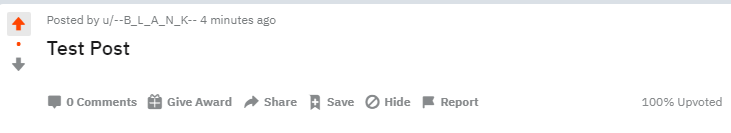 Old Reddit 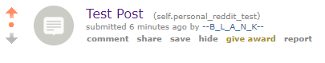 New Reddit Comments 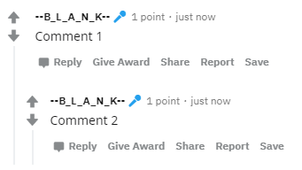 Old Reddit Comments 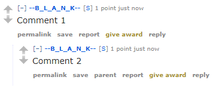 | Reddit | Upvote & Downvote Arrows, some subs use custom CSS and some screenshots are from mobile apps but they're usually pretty similar and can be easily identified.    

Click to reveal text (for dramatic effect)
 Also you should know this, it's called TranscribersOf**Reddit**
 | [Official Template](https://www.reddit.com/r/TranscribersOfReddit/wiki/formats/images/reddit)
| Post + Comment 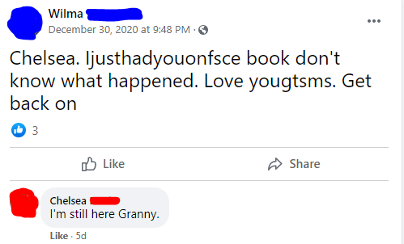 | Facebook | Privacy Symbol (Black & White Globe, 2 People, Lock).  Like Button (Thumbs Up Outline on New). | [Official Template](https://www.reddit.com/r/TranscribersOfReddit/wiki/formats/images/facebook)
| Post  Reply/Comment 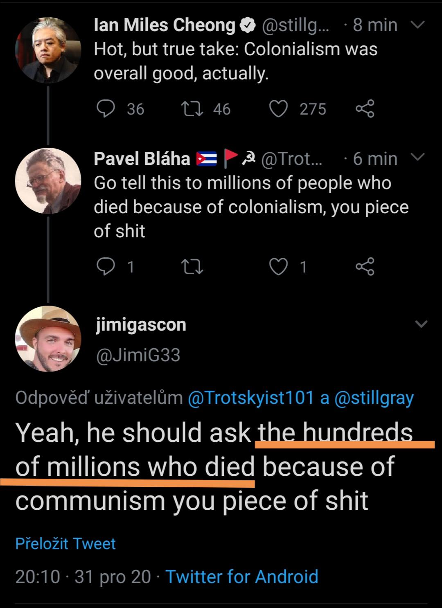| Twitter | Bolded name to the right of a profile picture and a mention (@username) underneath that. | [Official Template](https://www.reddit.com/r/TranscribersOfReddit/wiki/formats/images/twitter)
| Messages  | Discord | Username followed by date stamp, generally with a grey-ish background.    

Click to reveal text (Controversy Warning)
 Unless they're one of those people who uses light theme, in which case, same thing except your eyes are now burned out
 | [Unofficial Template](res/discord/template.md)
| Post 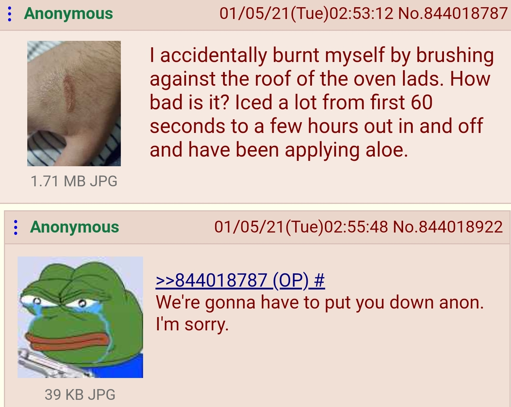 Greentext  | 4Chan | Brownish background, post header with name in greentext on the left side and the date & number in the right side in reddish font. | [Official Template](https://www.reddit.com/r/TranscribersOfReddit/wiki/formats/images/greentext)
| Post 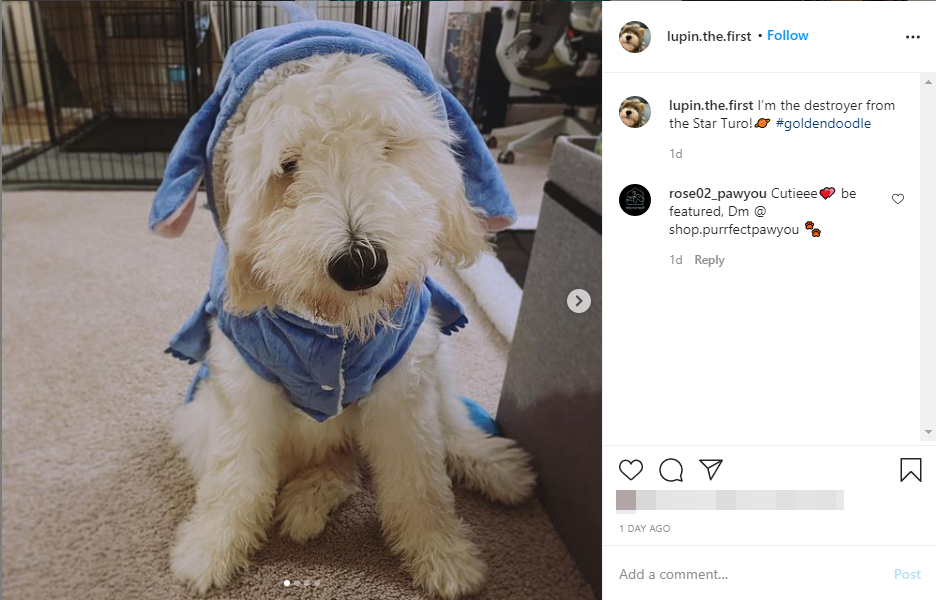 Stories  | Instagram | Image/Post on the left, username in the topright with `Follow` beside it. Triangle paper airplane design pointing towards the topleft near the message/comment bar. | [Text Message Template for DMs](https://www.reddit.com/r/TranscribersOfReddit/wiki/formats/images/textmessages), No Post/Story Template Yet.
| Post and Comments 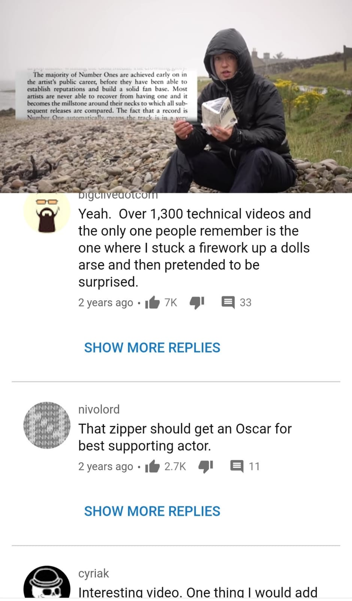 Comments 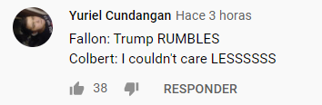|Youtube|Most posts are uploaded to reddit with comments, which have either Black or White Background. Every comment has a profile picture and a username. There are like/dislike buttons. The number of points the comment has is displayed between this buttons.  |  No official template yet. [Use generic social media](https://www.reddit.com/r/TranscribersOfReddit/wiki/formats/images/other)
| Post + Answer 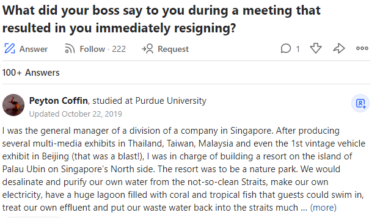 | Quora | Blue framed pencil icon with the text `Answer`, followed by a follow icon (and sometimes a request icon) underneath a bolded title. Answers usually are formatted with the name in bold, followed by `experiences` after the name separated with a comma. Underneath that is either `Answered` followed by a date or `Updated` followed by a date. | [Official Template](https://www.reddit.com/r/TranscribersOfReddit/wiki/formats/images/quora)
| Post + Comment 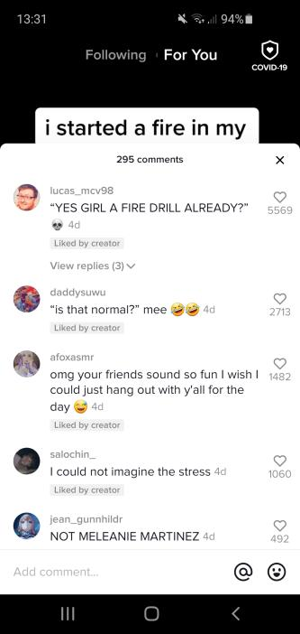 | TikTok | Extremely similar to Instagram except there's a number under the heart icon. If something has been `liked by the creator` then it says that underneath it. It has the time a comment was posted after the comment text. | No official (or unofficial) template yet.
| Review + Reply 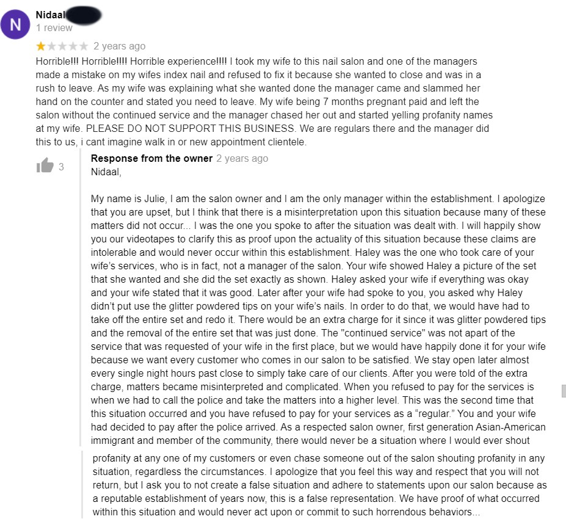 | Google Reviews | Username, then number of reviews, then stars. | [Unofficial Template](res/google/review.md)
