# Platform Reference for [r/TranscribersOfReddit](https://www.reddit.com/r/TranscribersOfReddit/wiki/index)

  

An *unofficial* repository of references (and sometimes unofficial templates) for various platforms that r/TranscribersOfReddit users may come across. (Partly inspired by u/Halailah and [ToR-Repost-Collection](https://github.com/codingJWilliams/ToR-Repost-Collection)).

The example screenshots are either created by me, taken from Reddit, or from various other image websites.

Keep in mind, when in doubt, ask the mods (or other transcribers). Also keep in mind that when copying an unofficial template in the repo, copy the raw text (click the `Raw` button in the file) or the formatting won't appear properly in reddit.

## Issues

If there's a platform you encountered while transcribing that isn't in this list, you can create an issue to add it using the [new platform template](https://github.com/TheodoreHua/ToR-Platform-Chart/issues/new?assignees=&labels=new+platform&template=platform-request.md&title=%5BPLATFORM%5D), if you feel a platform in the table should be updated, whether it's if the wording is confusing, there's a typo, or something is incorrect, you can create an issue with the [edit template](https://github.com/TheodoreHua/ToR-Platform-Chart/issues/new?assignees=&labels=platform+update&template=platform-update.md&title=Update+%5BPLATFORM%5D+with+%5BTYPO%2FNEW+ASPECT%5D), if a platform that's currently in the table doesn't have an official template or an unofficial template, you can request that an unofficial template be created using the [template request template](https://github.com/TheodoreHua/ToR-Platform-Chart/issues/new?assignees=&labels=need+template&template=unofficial-template-request.md&title=Unofficial+Template+for+%5BPLATFORM%5D), and lastly, if none of the above situations fit whatever you want changed, you can open a [blank issue](https://github.com/TheodoreHua/ToR-Platform-Chart/issues/new) and write your own descriptions. If you feel that you can update it yourself, create the issue, then create a pull request to update the document.

## Pull Requests

Pull requests are always appreciated and help a lot (both me and future users). In the case that you don't know how, you may ask me in the ToR Discord (either to have me just add it or to learn how to create a PR). If you don't know where to start, go to the issues page and pick one of them that hasn't been taken by someone else. Then comment that you're doing it or so that others don't work on it as the same time as you (if you're a contributor, you can self-assign the issue). If you would like to be added as a contributor, message me on discord.

## Table

The table is split into sub-categories, to make it easier for you to find a certain screenshot if you can figure out what category the platform belongs to. If you think the screenshot doesn't belong to any of the categories, it might be located in the `Other` section. There is a chance that the platform may not be in this table, and if that's the case you can always ask the `#transcribing` channel on discord.

Social Media

| Screenshot | Platform Name | Identifying Features | Template |
|------------|---------------|----------------------|------------------------------|
|  | Facebook | Privacy Symbol (Black & White Globe, 2 People, Lock).  Like Button (Thumbs Up Outline on New). | [Official Template](https://www.reddit.com/r/TranscribersOfReddit/wiki/formats/images/facebook)
| Post   Reply/Comment | Twitter | Bolded name to the right of a profile picture and a mention (@username) underneath that. | [Official Template](https://www.reddit.com/r/TranscribersOfReddit/wiki/formats/images/twitter)
| Post   Stories  | Instagram | Image/Post on the left, username in the topright with `Follow` beside it. Triangle paper airplane design pointing towards the topleft near the message/comment bar. | [Unofficial Template](res/instagram/templates)
| Profile 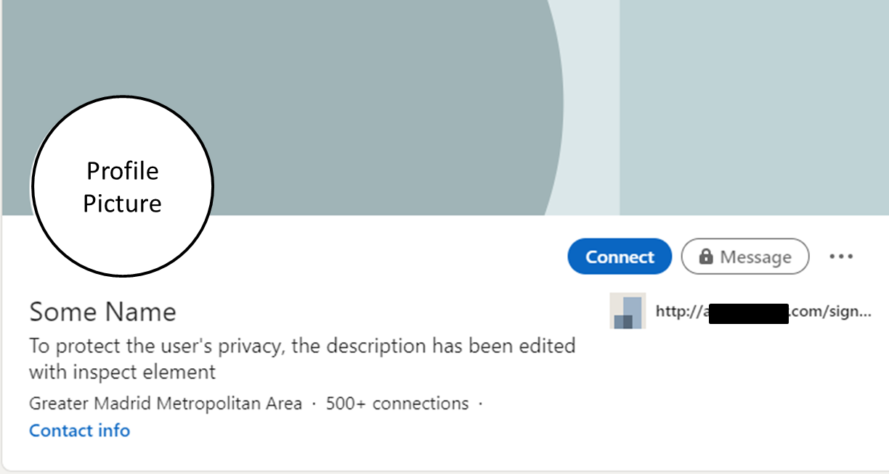  Post 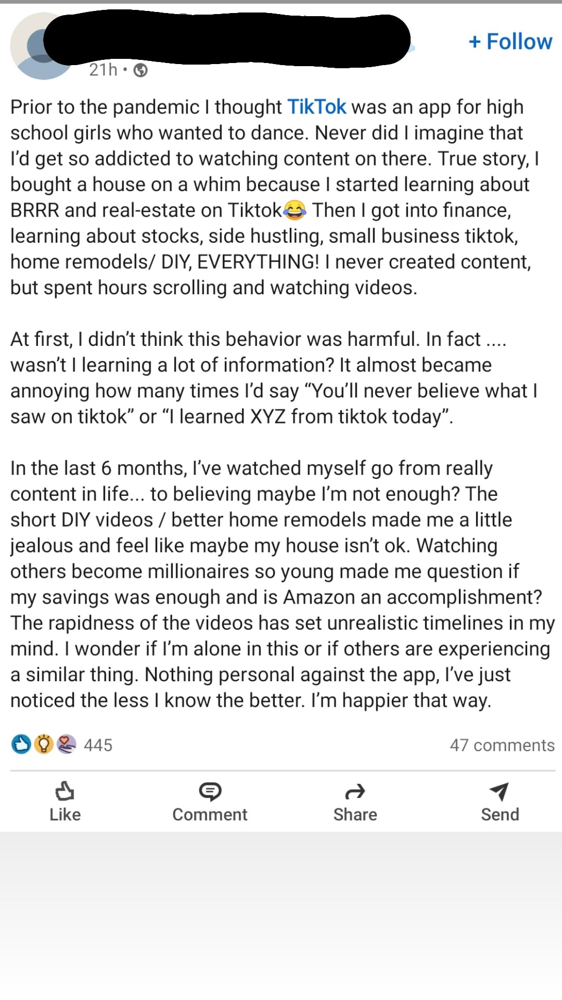 | LinkedIn|All linkedin posts, and profiles, have usernames, and profile pictures. The most important characteristic is that all linkedin profiles have their position under their name. Every post has reactions, similar to facebook (see bottom of image 3), but with different icons (a lightbulb for example). Most job adverts are in linkedin. If you see the word "Connections", it is Linkedin. | [Unofficial Template](res/linkedin/templates)
| Post 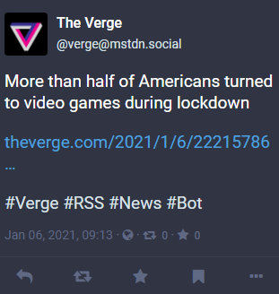  Comment 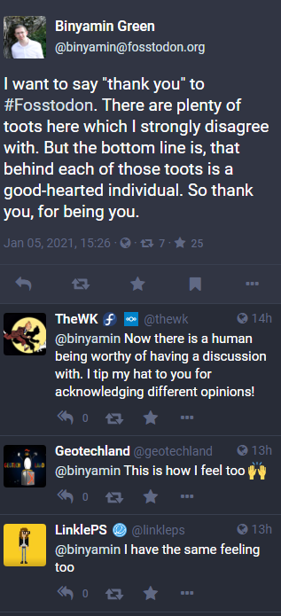 | Mastodon | Like twitter except the mention is formatted in `@username@domain`. The domain varies as there are different Mastodon instances. The date, privacy (globe, lock, etc), boosts (equivalent to retweet), and stars are located under the post. Generally the buttons are in the order reply, boost, star, bookmark, more. | [Unofficial Template](res/mastodon/templates)
| Notes 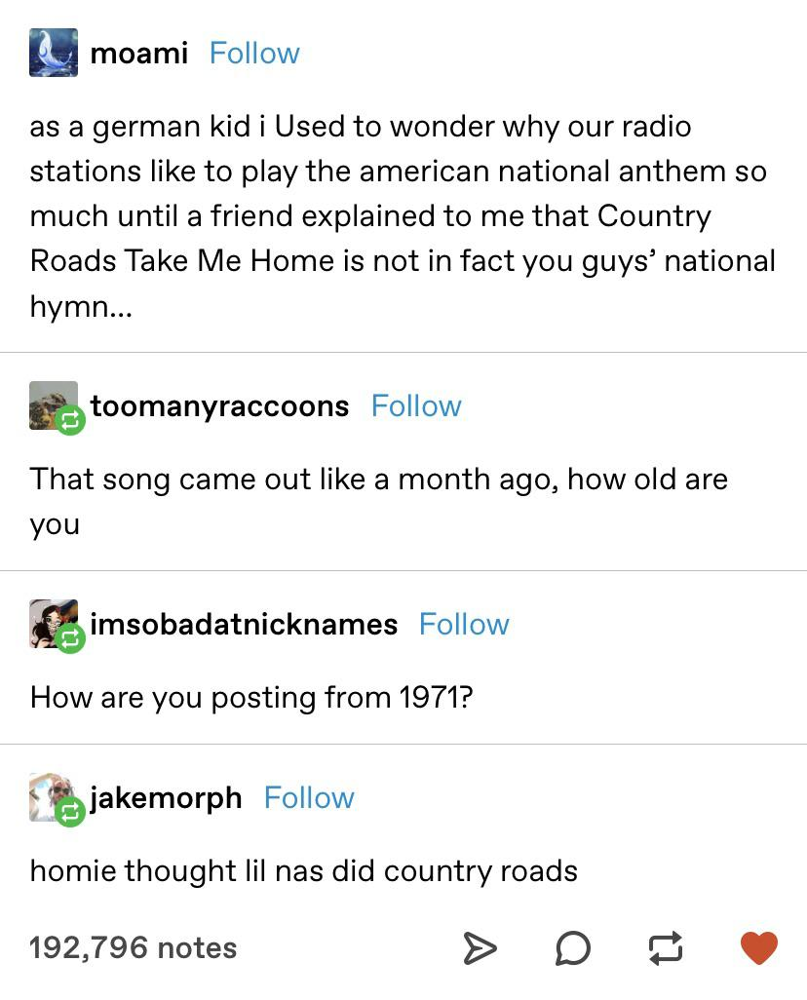  Non-Notes 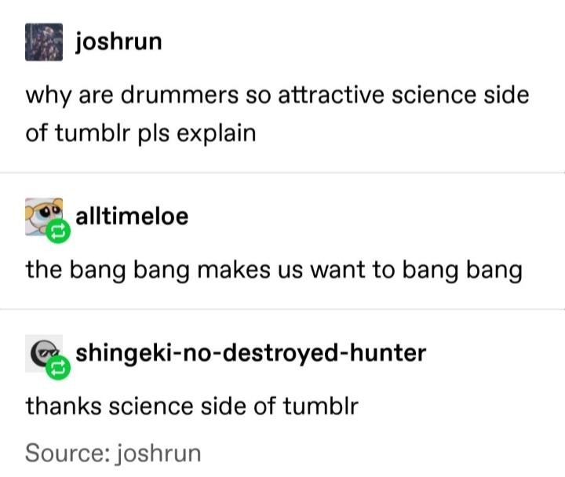 | Tumblr | A square profile picture followed by a bolded name and sometimes a blue `follow` button. Multiple comments/posts/notes (whatever they're called) are separated by a line. Sometimes you can see the text `X notes` under it, that's usually a telltale sign of a tumblr post. | [Official Template](https://www.reddit.com/r/TranscribersOfReddit/wiki/formats/images/socialmedia#wiki_tumblr)
| Post   Comment 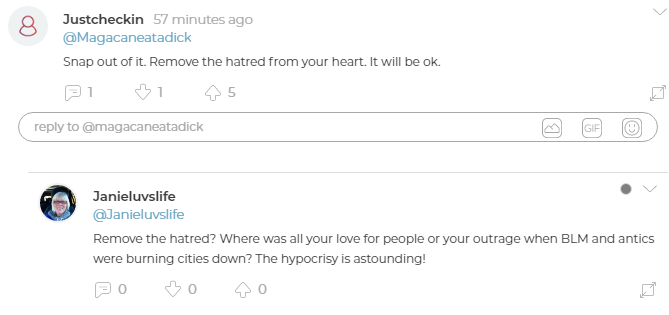 | Parler | For posts, profile picture on the left and a bold profile name on the right of the profile picture. Under the profile name is a handle, to the right of the profile name is the date/time. Under the text body is a minimalistic comment, downvote, and upvote icon. There is a number next to the upvote arrow. Then to the bottom right of the post there is a square with arrows on opposite corners, the top right has a downward facing arrow.  Comments are in the same format except they are slightly indented and missing the date stamp next to the name.| [Unofficial Template](res/parler/templates)
| 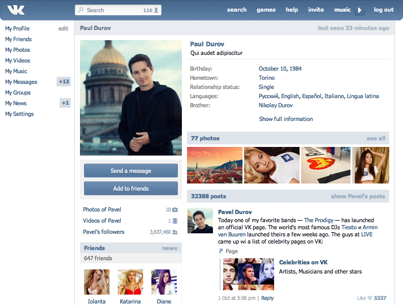 | VK | If it looks like it's a strange Facebook ripoff, it's VK | [Unofficial Template](res/vk/templates)

Dating

| Screenshot | Platform Name | Identifying Features | Template |
|------------|---------------|----------------------|------------------------------|
| Profile 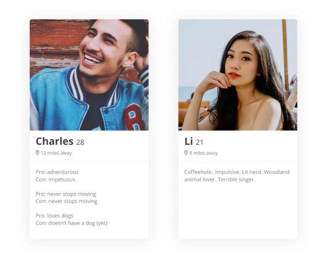  Messages 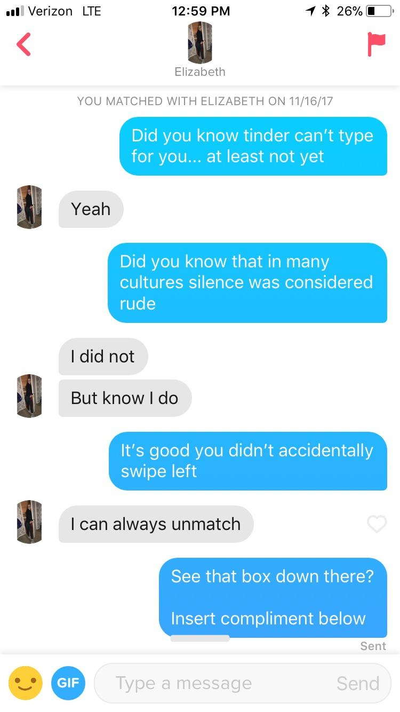 | Tinder | For profiles: Large profile picture at the top, bold name, to the right of the name is their age, under the name is a distance. After that is a line break, after the line break is their bio.  For messages: Pink-reddish left arrow on the left of the header, followed by a small picture and name, to the right of the header is a report flag. | [Unofficial Template](res/tinder/templates)
| 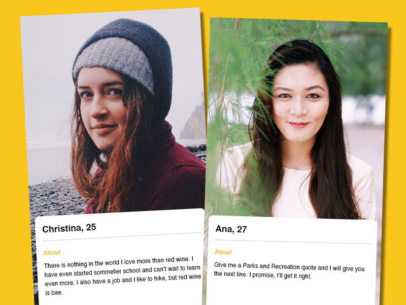 | Bumble | Large banner profile picture with a card like pop up. The card is in the format of `Name, Age` followed by a line break and their bio. | [Unofficial Template](res/mumble/template.md)

Messaging

| Screenshot | Platform Name | Identifying Features | Template |
|------------|---------------|----------------------|------------------------------|
| Cozy 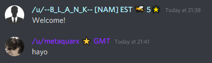  Compact 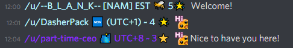 | Discord | Username followed by date stamp, generally with a grey-ish background.    

Click to reveal text (Controversy Warning)
 Unless they're one of those people who uses light theme, in which case, same thing except your eyes are now burned out
 | [Unofficial Template](res/discord/template.md)
| 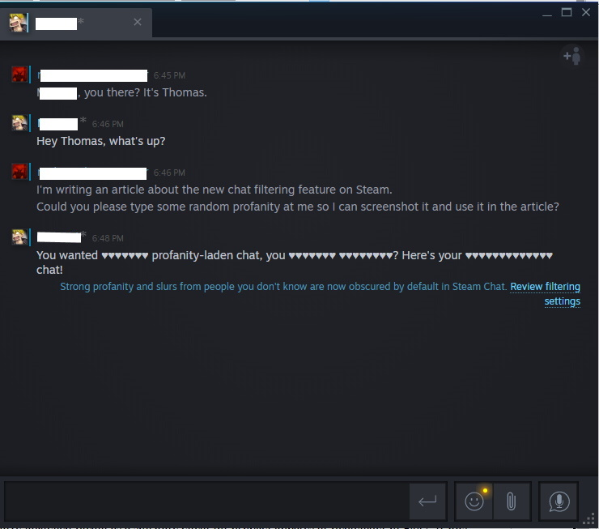 | Steam Chat | Small profile picture with blue line on the right of it followed by a username followed by a timestamp. An icon with a plus arrow and person is located in the top right of the chat window. The person the user is chatting with is shown in a tab list at the top of the window. Under that is the message body. | [Unofficial Template](res/steam/templates/messages.md)

Media Sharing

| Screenshot | Platform Name | Identifying Features | Template |
|------------|---------------|----------------------|------------------------------|
| Post and Comments   Comments  | Youtube | Most posts are uploaded to reddit with comments, which have either Black or White Background. Every comment has a profile picture and a username. There are like/dislike buttons. The number of points the comment has is displayed between this buttons.  |  [Unofficial Template](res/youtube/templates)
|  | TikTok | Extremely similar to Instagram except there's a number under the heart icon. If something has been `liked by the creator` then it says that underneath it. It has the time a comment was posted after the comment text. | [Unofficial Template](res/tiktok/templates)
| 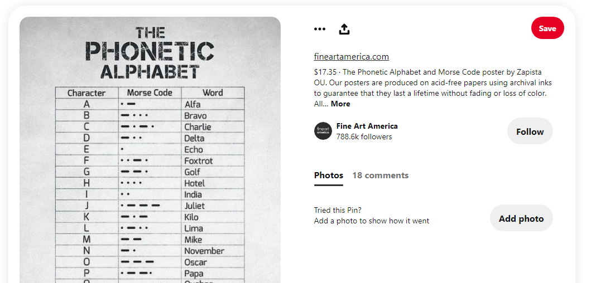 | Pinterest | Image or Video on the left, 3 dots and an upload symbol on the right with a large red `Save` button. Link to the image with only th domain is directly under that, followed by a description. On the bottom there's a profile picture followed by `User saved to Topic/Collection` (or whatever it's called). | [Unofficial Template](res/pinterest/templates)
| Streaming and Chat 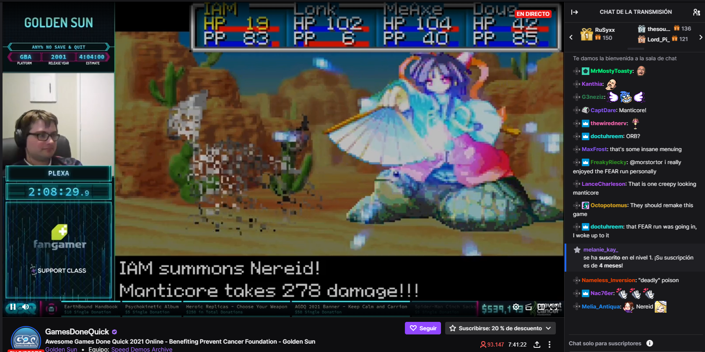  Close Up of the chat 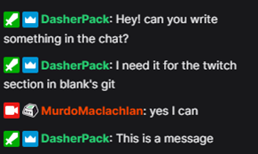 | Twitch | There are multiple ways to recognize twitch. The easiest one is looking at the chat. There are people with different colours, and badges before their name. If one of them is a crown, that is twitch. If you see badges, probably is also twitch. In the top right we can see some presents. At the bottom we can see the streamer, with 2 options: Follow (in purple) and Subscribe (in grey). The title of the streaming is just below the streamer name. It is usually in a really dark grey. | [Unofficial Template](res/twitch/templates)

Forums

| Screenshot | Platform Name | Identifying Features | Template |
|------------|---------------|----------------------|------------------------------|
| New Reddit   Old Reddit   New Reddit Comments   Old Reddit Comments  | Reddit | Upvote & Downvote Arrows, some subs use custom CSS and some screenshots are from mobile apps but they're usually pretty similar and can be easily identified.    

Click to reveal text (for dramatic effect)
 Also you should know this, it's called TranscribersOf**Reddit**
 | [Official Template](https://www.reddit.com/r/TranscribersOfReddit/wiki/formats/images/reddit)
| Post   Greentext  | 4Chan | Brownish background, post header with name in greentext on the left side and the date & number in the right side in reddish font. | [Official Template](https://www.reddit.com/r/TranscribersOfReddit/wiki/formats/images/greentext)
|  | Quora | Blue framed pencil icon with the text `Answer`, followed by a follow icon (and sometimes a request icon) underneath a bolded title. Answers usually are formatted with the name in bold, followed by `experiences` after the name separated with a comma. Underneath that is either `Answered` followed by a date or `Updated` followed by a date. | [Official Template](https://www.reddit.com/r/TranscribersOfReddit/wiki/formats/images/quora)
| Question 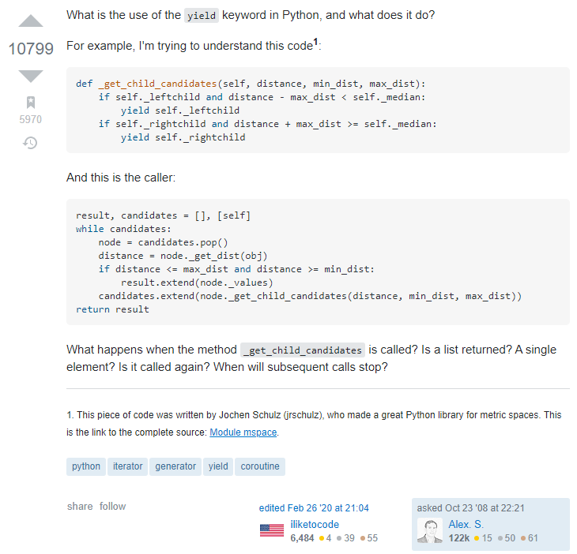  Answer 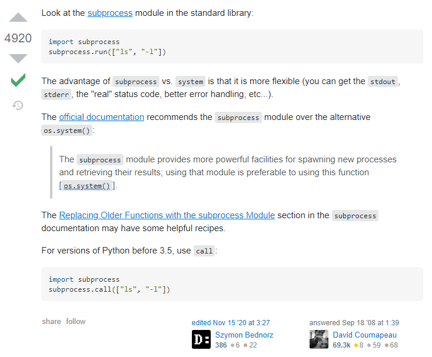 | Stack Exchange | Upvote/Downvote triangles similar to Reddit on the left with a number in between the two arrows. There's a description to the right of that and underneath that are tags. In the bottom right there is a rectangle which contains the username, profile picture, and date. There may also of those boxes to the left of the most bottom right box, that happens if the question/answer is edited. In order to tell whether a screenshot is a question or an answer, look at the text before the date in the rectangle. A question fill have the text `asked` and an answer will have the text `answered`. Similar to Reddit, Stack Exchange has sub-categories (like subreddits). Stack Overflow, which is used in this example, is one of them. As such, Stack Exchange screenshots may vary slightly. | [Unofficial Template](res/stackexchange/templates)

Reviews

| Screenshot | Platform Name | Identifying Features | Template |
|------------|---------------|----------------------|------------------------------|
|  | Google Reviews | Username, then number of reviews, then stars. | [Unofficial Template](res/google/review.md)
| Review 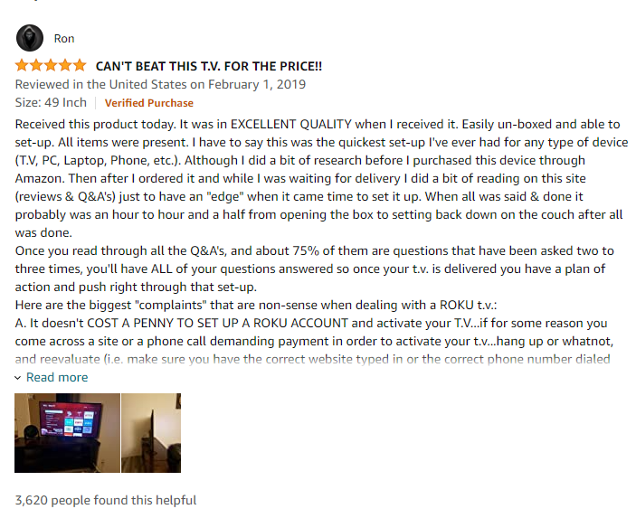 Questions and Answers 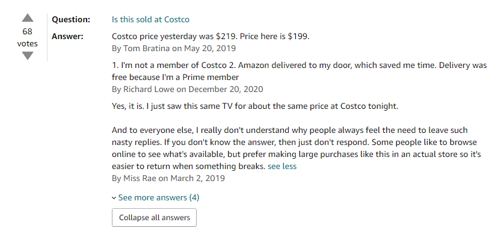 | Amazon | Amazon reviews are similar to most review sites. To differentiate, you must look closely. The images of the review are at the bottom of the page. Amazon reviews have a rating system: Helpfulness. If you see "x people found this helpful", it's amazon. If you see "Verified Purchase", it is also amazon. The questions and answers can be identified easily. They have an upvote/downvote rating in the left. The user who posted the question is anonymous, but the users who answered aren't.  Answers also have the date when they were posted | [Unofficial Template](res/amazon/templates)
| 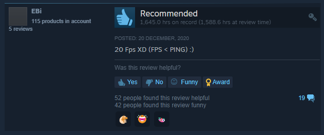 | Steam Review |  | [Unofficial Template](res/steam/templates/review.md)

Other

| Screenshot | Platform Name | Identifying Features | Template |
|------------|---------------|----------------------|------------------------------|
| Commit 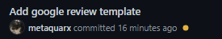  Issue 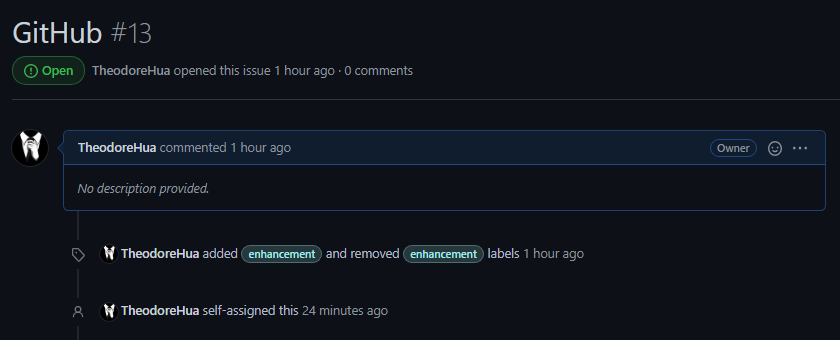 | GitHub | For commits, bolded commit message and underneath that, the profile picture and the name in bold to the right of the profile picture followed by `committed` and the date.  For issues, a large title and underneath that the status (Open & Closed), and the text `[user] opened this issue [time] ago` to the right of it.| [Unofficial Template](res/github/templates)
| 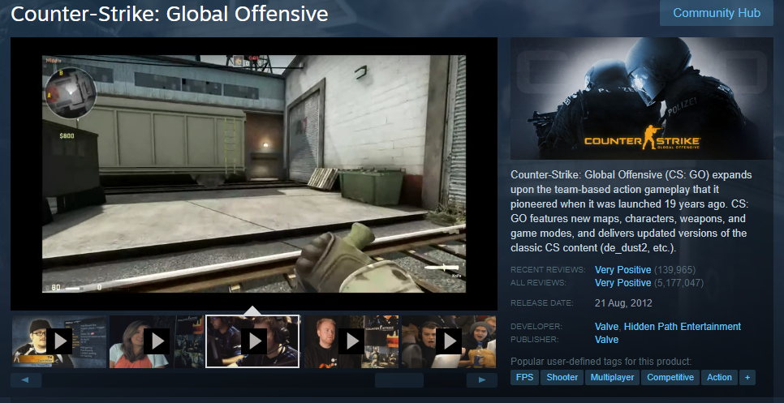 | Steam Store | Game title as a header at the top, under that is an image and video gallery.  To the right of the image/video gallery is a banner with a description of the game under that as well as review, developer, and tag info under the description. | [Unofficial Template](res/steam/templates/store.md)
| Top Definition 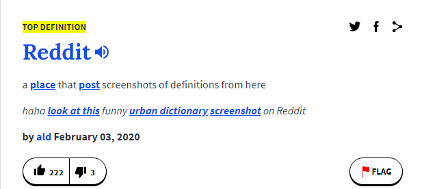  Other Ranked 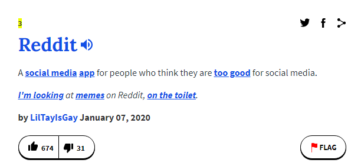 | Urban Dictionary | The text `Top Definition` or a number/rank in the top left, social and sharing icons in the top right. Large blue text for the term with a speaker icon to the right of it. Under that is the description (most of the time, certain words in the description will lead to another definition.). Finally under that is the author, date, like & dislike buttons, and a flag button. | [Unofficial Template](res/urbandictionary/template.md)

## Flowchart

These are flowcharts created by u/Halailah, not me. Full credit to her for these.

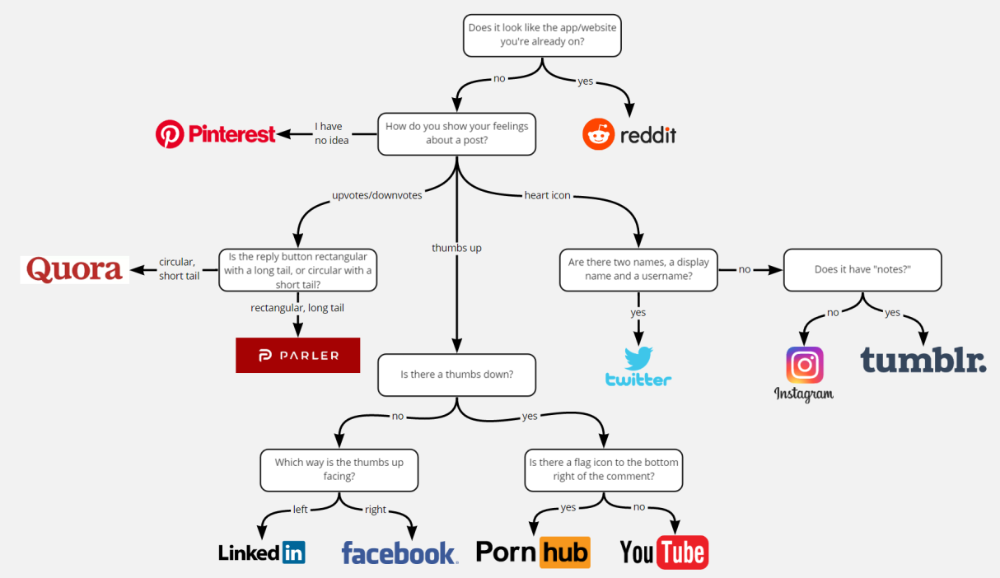
